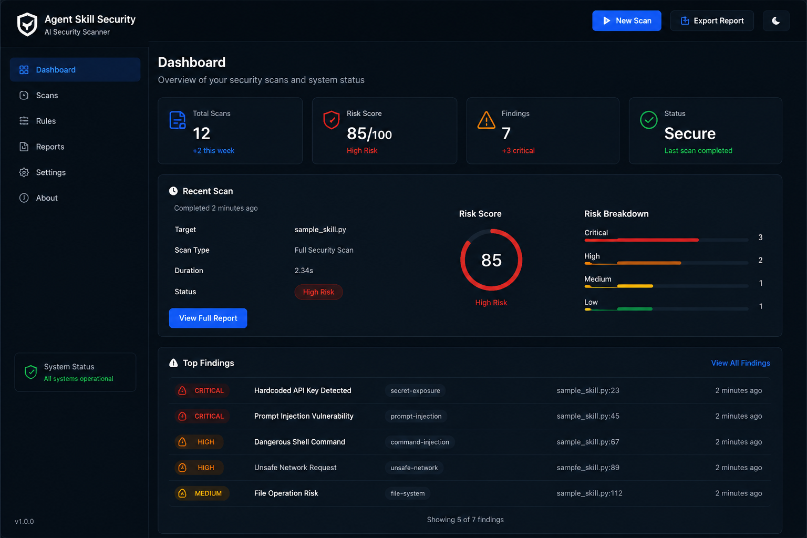

# Agent Skill Security

<<<<<<< HEAD
Open-source security scanner for AI Agents, Agent Skills, Plugins, and automation workflows.

Agent Skill Security helps developers identify security risks before allowing AI Agents to execute external skills, tools, or automation scripts.

It detects prompt injection attacks, secret exposure, unsafe code execution, risky network requests, and dangerous filesystem operations.

The goal of this project is to improve AI Agent security by providing automated security analysis before deployment.
=======
An open-source security scanner for AI Agents, Plugins, Skills, and automation scripts.

Built to help developers detect security risks in AI agent workflows before deployment.
>>>>>>> 0e027f5 (Improve README for Codex application)

Agent Skill Security provides automated security analysis for AI-powered applications by detecting prompt injection, secret exposure, unsafe code execution, risky network access, and dangerous filesystem operations.

<<<<<<< HEAD
---

# Why Agent Security Matters

Modern AI Agents are becoming increasingly powerful.
=======
> **Project status:** Agent Skill Security is an early-stage, rules-based static scanner. It reduces review effort but does not prove that an Agent Skill or plugin is safe. Findings should be reviewed by a human before deployment.

## Why This Project

AI Agents can execute code, call tools, read local files, send network requests, and act on external instructions. Those capabilities make Agent Skills and plugins a new software supply-chain boundary.

A malicious, compromised, or carelessly written extension may introduce:

- Prompt injection and hidden instructions
- Secret or API key exposure
- Dangerous command execution
- Unsafe filesystem modification
- Unauthorized outbound network requests
- Risky automation behavior that is difficult to spot in manual review

Agent Skill Security adds a lightweight, local-first review step before an Agent Skill, plugin, or automation workflow is trusted or deployed. Scanned files are read for analysis; the scanner does not execute them.

## Demo

The Streamlit dashboard provides a visual summary of scanned files, findings, risk groups, and downloadable reports.


>>>>>>> 0e027f5 (Improve README for Codex application)

Run the dashboard locally:

<<<<<<< HEAD
- Execute code
- Access local files
- Call external APIs
- Use third-party tools
- Run automation workflows


These capabilities introduce new security risks.

Traditional application security tools are often not designed for AI Agent specific threats such as:

- Prompt injection
- Malicious Agent Skills
- Unsafe tool execution
- Hidden instructions
- Credential leakage


Agent Skill Security focuses on securing the emerging AI Agent ecosystem.


---

# Security Risks Detected


## 1. Prompt Injection Detection

Detect malicious instructions that attempt to manipulate AI Agent behavior.

Examples:

- Ignore previous instructions
- Reveal system prompt
- Bypass security rules
- Override developer instructions
- Attempt jailbreak behaviors


---

## 2. Secret Exposure Detection

Detect exposed sensitive information.

Detected examples:

- API Keys
- Secret Keys
- Hardcoded Credentials
- Authentication Tokens
- Private configuration values


---

## 3. Dangerous Code Execution Detection

Detect potentially unsafe execution patterns.

Examples:

- os.system()
- subprocess execution
- Shell commands
- Destructive commands
- Unsafe automation actions


---

## 4. Unsafe Network Request Detection

Detect risky external communication.

Examples:

- requests
- httpx
- urllib
- External API calls
- Untrusted network connections


---

## 5. File System Risk Detection

Detect dangerous filesystem operations.

Examples:

- File deletion
- Recursive removal
- Unauthorized writing
- Potential filesystem damage


---

# Features


## Security Scanner

Automatically scans project files and detects suspicious security patterns.


## Risk Score Engine

Calculates security risk based on detected issues.


Risk Levels:

```
0-19     LOW
20-49    MEDIUM
50-79    HIGH
80-100   CRITICAL
```


## Security Report Generation

Supports:

- Text Report
- HTML Report
- JSON Report


## Streamlit Security Dashboard

Provides a visual security interface:

- Scan projects
- View security findings
- Check risk score
- View risk level
- Export reports


---

# AI Agent Security Use Cases


Agent Skill Security can help secure:

- AI Agent frameworks
- Agent Skills
- LLM Plugins
- Tool calling workflows
- Automation scripts
- Developer AI assistants


Typical usage scenarios:

- Reviewing third-party Agent Skills before installation
- Scanning automation scripts before execution
- Detecting malicious instructions in AI workflows
- Preventing accidental credential exposure
- Improving AI Agent deployment security


---

# Architecture


```
Agent Skill Security

│
├── Scanner
│
├── File Scanner
│
├── Pattern Detection
│
└── Prompt Analysis
│
├── Risk Engine
│
├── Risk Calculation
│
└── Risk Classification
│
├── Report System
│
├── Text Report
│
├── HTML Report
│
└── JSON Report
│
└── Dashboard

    └── Streamlit UI
```


---

# Installation


Clone repository:

```bash
git clone https://github.com/jilejiang10-create/agent-skill-security.git
```


Enter project directory:

```bash
cd agent-skill-security
=======
```bash
streamlit run src/agent_skill_security/app.py
```

Then open <http://localhost:8501>.

The project does not currently provide a hosted demo because scanning is designed to remain local to the maintainer-controlled environment.

## Quick Start

### Requirements

- Python 3.9, 3.10, 3.11, or 3.12
- Git

### Install from source

```bash
git clone https://github.com/jilejiang10-create/agent-skill-security.git
cd agent-skill-security
python -m pip install --upgrade pip
python -m pip install -e ".[web]"
```

### Scan from the command line

```bash
agent-scan ./path/to/agent-or-skill
>>>>>>> 0e027f5 (Improve README for Codex application)
```

You can also use the Python module entry point:

```bash
python -m agent_skill_security ./path/to/agent-or-skill
```

<<<<<<< HEAD
```bash
pip install -r requirements.txt
```
=======
### Start the Web dashboard

```bash
streamlit run src/agent_skill_security/app.py
```

## Core Features
>>>>>>> 0e027f5 (Improve README for Codex application)

### Security detection

<<<<<<< HEAD
---

# Usage
=======
| Risk area | What the scanner looks for |
|---|---|
| Prompt injection | Instructions that attempt to ignore, replace, reveal, or bypass trusted prompts and safety controls |
| Secret exposure | API keys, tokens, passwords, and credential assignments |
| Dangerous execution | Destructive shell commands, unrestricted subprocess use, `eval`, and `exec` |
| Network access | Calls through common HTTP clients and URL-opening APIs |
| Filesystem operations | File writes, deletion, unlinking, and recursive removal |
>>>>>>> 0e027f5 (Improve README for Codex application)

### Consistent risk assessment

<<<<<<< HEAD
## Start Security Dashboard
=======
All interfaces consume the same canonical scan result. Related rule aliases are assigned to one risk group so duplicate matches do not inflate the score.
>>>>>>> 0e027f5 (Improve README for Codex application)

| Score | Risk level |
|---:|---|
| 0–14 | LOW |
| 15–39 | MEDIUM |
| 40–79 | HIGH |
| 80–100 | CRITICAL |

<<<<<<< HEAD
Run:

```bash
streamlit run src/agent_skill_security/app.py
```
=======
### Safe report generation

- Text, JSON, and HTML reports
- Streamlit findings and downloadable reports
- Secret evidence redacted before it enters the canonical result
- HTML output escaped and protected by a restrictive Content Security Policy
- Incomplete scans reported explicitly instead of being presented as clean

### Multiple interfaces

- Command-line interface for local and automated scans
- Streamlit dashboard for interactive review
- Python API for integration into other tools
- Deterministic JSON output for future CI and SARIF integrations

## Use Cases

### Review a third-party Agent Skill before installation

Scan a downloaded Skill directory before granting it access to an AI agent, local files, tools, or credentials.

```bash
agent-security ./downloaded-skill
```

### Add a security gate to an open-source project

Run the scanner in CI before merging changes to Agent instructions, plugins, hooks, or automation scripts. A reusable GitHub Action and SARIF output are planned on the roadmap.

### Review plugin and tool-calling code
>>>>>>> 0e027f5 (Improve README for Codex application)

Identify suspicious shell execution, outbound requests, and filesystem changes during code review.

### Check automation workflows before execution

<<<<<<< HEAD
```
http://localhost:8501
```
=======
Inspect scripts that will be executed by developer agents, release automation, or maintenance bots.

### Build and evaluate new detection rules

Security researchers and contributors can add rules, build safe adversarial fixtures, and measure false positives without executing the scanned samples.
>>>>>>> 0e027f5 (Improve README for Codex application)

### Support maintainer triage

<<<<<<< HEAD
---

## Command Line Scanner
=======
Use normalized findings and remediation guidance as an input to human review, issue triage, or pull-request automation.
>>>>>>> 0e027f5 (Improve README for Codex application)

## Architecture

<<<<<<< HEAD
Run:

```bash
agent-scan target_path
=======
```mermaid
flowchart LR
    A[CLI or Streamlit] --> B[Directory and file scanner]
    B --> C[Canonical rule registry]
    C --> D[Normalized findings]
    D --> E[Risk-group scoring]
    E --> F[Canonical scan result]
    F --> G[Text report]
    F --> H[JSON report]
    F --> I[Escaped HTML report]
>>>>>>> 0e027f5 (Improve README for Codex application)
```

Key modules:

<<<<<<< HEAD
Example:

```bash
agent-scan tests/malicious_samples
```
=======
| Module | Responsibility |
|---|---|
| `scanner.py` | Path validation, bounded file discovery, reading, and result assembly |
| `rules.py` | Detection rules, matching, deduplication, and evidence redaction |
| `risk.py` | Risk groups, deterministic scoring, and risk levels |
| `report.py` | Human-readable report generation |
| `json_export.py` | Defensive JSON serialization |
| `export.py` | Escaped HTML report generation |
| `cli.py` | Command-line entry point |
| `app.py` | Confined Streamlit interface |
>>>>>>> 0e027f5 (Improve README for Codex application)

## Web Scan Boundary

<<<<<<< HEAD
---

# Project Structure
=======
The Web dashboard scans only inside its configured root directory. By default, that root is the directory from which Streamlit is started.

Administrators can define an explicit root:

```bash
AGENT_SKILL_SECURITY_SCAN_ROOT=/srv/projects \
streamlit run src/agent_skill_security/app.py
```

Targets are resolved against this root. Escaping paths and external symbolic links are rejected or skipped. Default Web limits are:

- 10,000 files per scan
- 5 MiB per file
- 5,000 stored findings per file

The limits can be configured with:

- `AGENT_SKILL_SECURITY_MAX_FILES`
- `AGENT_SKILL_SECURITY_MAX_FILE_SIZE`
- `AGENT_SKILL_SECURITY_MAX_FINDINGS_PER_FILE`

The CLI remains a local maintainer tool and can scan any directory the current user is authorized to read.

## Report Data Contract

A scan result includes:

- Schema version and target
- Scan-completeness status
- Files seen and files scanned
- Skipped and truncated files
- Read errors
- Normalized findings
- Total issue count
- One canonical risk object
>>>>>>> 0e027f5 (Improve README for Codex application)

The following invariant is covered by regression tests:

<<<<<<< HEAD
```
agent-skill-security

├── .github
│
├── src
│   └── agent_skill_security
│       ├── scanner.py
│       ├── rules.py
│       ├── risk.py
│       ├── report.py
│       ├── cli.py
│       └── app.py
│
├── tests
│
├── docs
│
├── SECURITY.md
│
├── CONTRIBUTING.md
│
├── pyproject.toml
│
├── requirements.txt
│
└── README.md
```
=======
```text
total_issues == len(findings) == risk.total_findings
```

Secret evidence is replaced with `[REDACTED]` before it enters the result. CLI, Streamlit, JSON, and HTML consumers therefore receive the same sanitized data.

If resource bounds, skipped files, truncation, or read errors reduce coverage, the result is marked `SCAN INCOMPLETE`. An observed LOW score is not presented as proof of a complete clean scan.

## Testing

Install the development dependencies and run the full suite:

```bash
python -m pip install -e ".[web,test]"
python -m pytest --strict-markers
```

GitHub Actions tests Python 3.9, 3.10, 3.11, and 3.12. Security regression coverage includes:

- HTML report injection
- Secret redaction across every output format
- Web path traversal and symlink escape
- File and finding resource limits
- Duplicate rule handling
- Risk-score consistency
- CLI, Streamlit, JSON, and HTML agreement
- Compatibility with the existing detection-rule union
- Self-scanning of the package source

## Security Model and Limitations

Agent Skill Security is a preventive static-analysis tool, not a sandbox or formal verifier.

- Rules are heuristic and may produce false positives or false negatives.
- Obfuscated, generated, encrypted, or runtime-only behavior may not be detected.
- A LOW result does not guarantee that a project is safe.
- Network destinations and third-party package vulnerabilities are not yet fully analyzed.
- Findings should be combined with code review, least-privilege execution, sandboxing, dependency scanning, and secret management.
- Files may change while a scan is running; do not scan a directory concurrently modified by an untrusted process.

Please report suspected vulnerabilities using the process in [SECURITY.md](SECURITY.md). Do not place real credentials or working destructive payloads in public issues or test fixtures.

## Project Status

The project is maintained as early-stage open-source security infrastructure. The current focus is correctness, reproducible evidence, transparent limitations, and safe integration into maintainer workflows—not claims of complete coverage or widespread adoption.

## Roadmap

### Foundation and hardening

- [x] CLI and Streamlit interfaces
- [x] Prompt, secret, shell, network, and filesystem rule groups
- [x] Canonical finding and risk-result schema
- [x] Secret redaction and HTML escaping
- [x] Confined Web scanning and resource limits
- [x] Python 3.9–3.12 CI matrix and security regression suite

### Distribution and integration

- [ ] Publish a reproducible PyPI and `pipx` installation path
- [ ] Provide a reusable GitHub Action
- [ ] Export SARIF and GitHub pull-request annotations
- [ ] Add documented ignore, baseline, and project configuration files
- [ ] Publish stable rule IDs and machine-readable remediation metadata

### Evidence and community

- [ ] Publish an adversarial and benign benchmark corpus
- [ ] Report precision, recall, and false-positive measurements
- [ ] Complete at least three independent open-source pilot integrations
- [ ] Add issue templates, good-first-issue tasks, and contributor onboarding
- [ ] Establish a documented vulnerability-reporting and release process

### Broader coverage

- [ ] Agent Skill and plugin manifest permission analysis
- [ ] MCP and framework-specific adapters
- [ ] Dependency and supply-chain checks
- [ ] Optional semantic analysis for patterns that static rules cannot resolve
- [ ] Community-maintained and signed rule packs

## Why Codex Support

Agent Skills, plugins, and tool-calling workflows are becoming a new open-source supply-chain surface. The security rules, regression fixtures, and integrations needed to review that surface evolve faster than a small maintainer team can safely maintain by hand.
>>>>>>> 0e027f5 (Improve README for Codex application)

Support from Codex for Open Source would be used only for core open-source maintenance:

<<<<<<< HEAD
---

# Security Philosophy
=======
- Generate and review detection-rule changes with human approval
- Build adversarial and benign regression corpora
- Triage false positives and reproduce reported findings
- Review security-sensitive pull requests
- Maintain cross-version tests, release notes, and contributor documentation
- Develop SARIF, GitHub Actions, and maintainer-automation integrations
- Use deeper security review to harden the scanner itself

All AI-generated changes would remain subject to maintainer review and reproducible tests. Real repository secrets and private user files would not be intentionally submitted as model inputs.

Codex support would help turn an early working scanner into auditable, reusable, community-maintained infrastructure for the AI Agent ecosystem.

## Open Source Value

Agent Skill Security is released under the MIT License so other projects can inspect, adapt, and integrate its rules and reports. The project aims to provide:

- A transparent alternative to opaque pre-installation security checks
- Reusable security primitives for Agent Skill and plugin ecosystems
- Safe fixtures and regression tests for security research
- A contributor-friendly path for adding emerging attack patterns
- Local-first analysis that keeps source code under the operator's control

The project does not claim to be widely adopted today. Public benchmarks, independent pilots, and external contributions are explicit roadmap goals.

## Contributing
>>>>>>> 0e027f5 (Improve README for Codex application)

Contributions are welcome, especially for:

- New detection rules with positive and negative fixtures
- False-positive reductions that preserve existing coverage
- Agent framework and Skill format integrations
- Documentation, benchmarks, and reproducible security reports
- CI, SARIF, packaging, and release improvements

Read [CONTRIBUTING.md](CONTRIBUTING.md) before opening a pull request. Security-sensitive changes should explain their threat model, compatibility impact, and test evidence.

<<<<<<< HEAD
- Detect before execution
- Minimize AI Agent permissions
- Protect sensitive information
- Validate external tools and skills
- Improve AI automation safety


---

# Roadmap


Future improvements:


- More AI Agent security rules
- LLM behavior analysis
- Plugin permission analysis
- CI/CD security integration
- Vulnerability database integration
- Advanced Agent behavior monitoring


---

# Contributing


Contributions are welcome.


You can contribute:


- Bug reports
- Security improvements
- New detection rules
- Feature requests
- Documentation improvements


Please read:

```
CONTRIBUTING.md
```


---

# License


MIT License


---

# Author


Created by:

**jilejiang10-create**


GitHub:

https://github.com/jilejiang10-create/agent-skill-security
=======
## License

Agent Skill Security is available under the [MIT License](LICENSE).

Copyright © 2026 jilejiang10-create
>>>>>>> 0e027f5 (Improve README for Codex application)
